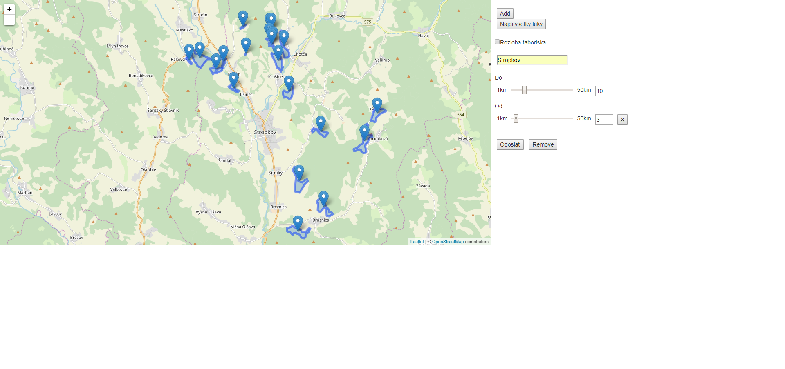
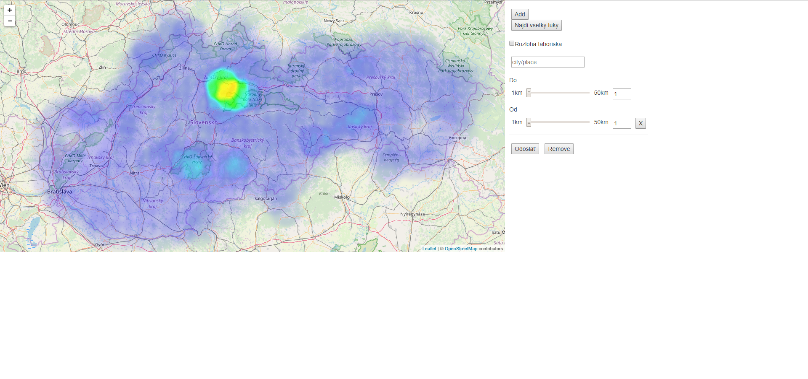

# Overview

Táto aplikácia zobrazuje na mape všetky lúky vhodné na táborenie, ktoré sa nachádzajú na Slovensku:
- vyhľadáva podľa vzdialenosti od mesta/miest v kilometroch
- vyhľadáva podľa rozmerov, ktoré táborisko bude mať (v m<sup>2</sup>)
- vyhľadá všetky lúky vhodné na táborenie na celom slovensku a zobrazí ich ako heat mapu
- vyhľadáva lúky od mesta/miest v kilometroch ale nie bližšie ako určitá hodnota v kilometroch
- všetky lúky sú vyhľadávané na celom Slovensku okrem národných parkov so stupňom ochrany vyšším ako 2 

This is it in action:




Aplikácia pozostáva z [backendu](#backend), kde je vytvorená [Node.js API](#API) pomocou [Node.js](https://nodejs.org/en/) s prístupom do databáz PostgreSQL, kde sú uložené dáta z [Open Street Maps](https://www.openstreetmap.org/) a z [frontendu](#frontend), ktorý využíva [AngularJS](https://angularjs.org/) a HTML, ktoý slúži ako klient.


# Frontend

Frontend aplikácie pozostáva z HTML stránky (`index.html`), ktorá je rozšírená o [AngularJS](https://angularjs.org/) modul a kontroler a Leaflet mapu. 

Celá relevantná funkcionalita sa nachádza v súbore `controller.js` (`./public/scripts/controller.js`). Kontroler vytvorený pomocou AngularJS umožňuje klientskej strane aplikácie:
- odosielať, príjmať a spracovávať dáta z [Node.js API](#API) pomocou GET a POST metód 
- spracované dáta v podobe markerov a vyznačených územý zobrazuje na mape 
- umožňuje dynamicky pridávať a odoberať možnosti vyhľadávania v okolí viacerích miest.

Dáta sú zobrazované na leaflet mape, ktorá má štýl mapy ako [Open Street Maps](https://www.openstreetmap.org/).

# Backend

Backend aplikácie je napísaný v JavaScripte s využitím prostredia Node.js a frameworku express, čo zjednodušuje vytvorenie API. Slúži na vytváranie dopytov na databázu a získané dáta spracováva z geojson formátu do json formátu.

## Data

Dáta o lúkach a mestách sa nachádzajú v Open Street Maps. Stiahnuté dáta pokrývali celé Slovensko. Na importovanie dát do databázy som použil nástroj osm2pgsql, ktorý vytvoril 4 tabluľky dát pre body, čiary, polygony a cesty. Pre rýchlejšie hľadanie som implementoval indexy pre polygony na stĺpce `landuse` pre rýchlejšie vyhľadávanie lúk a stĺpec `boundary` čo umožňuje rýchlejšie hľadanie Národných parkov na Slovensku. Ďalšie indexy som implementoval pre body na stĺpce `name` pre hľadanie názvov miest alebo dedín a tiež stĺpec `place` na určenie či sa jedná o mesto alebo dedinu. Dáta na spracovanie sú vytvorené pomocou `st_asgeojson` na stĺpec `way` v polygónoch a z GeoJsonu som vyparsoval do bežného Json formátu. Json formát sa ľahšie spracovával aj na klientskej strane pre pridávanie markerov a polygony.

## Api

**Nájdenie všetkých lúk okrem národných prakov**

`GET /allMeadows`

**Nájdenie lúk vo vzdialenosti**

`POST /query`

Telo API volania sa skladá z `rozloha`, čo určuje akú rozlohu majú mať nájdené lúky v m<sup>2</sup> a `data` čo je pole objektov v ktorých sa nachádzajú informácie o názve mesta alebo dediny a od a do akej vzdialenosti danej lokácie sa majú vyhľadávať vhodné lúky.
```
{
  "rozloha": 0,
  "data": [
    {
      "city": "Stropkov",
      "to": 10,
      "from": 5
    }
  ]
}
```

### Response

Odpovede na API volania sa líšia.

**Nájdenie všetkých lúk okrem národných prakov**

Odpoved sa skladá z 2 objektov. `success` hovorí o tom či operácia prebehla v poriadku a či sú vrátené dáta valídne, následne v poli s názvom `data` sú uložené objekty, ktoré obsahujú typ dát a polia `coordinates`, kde sú zapísané koordináty lúky v podobe zemepisnej dĺžky a šírky.
```
{
  "success": true,
  "data": [
    {
      "type": "Point",
      "coordinates": [16.8441320152977, 48.3763143001084]
    },
    {
      "type": "Point",
      "coordinates": [16.8488449981387, 48.3746031631243]
    }
  ]
}
```

**Nájdenie lúk vo vzdialenosti**

Odpoveď na API volanie obsahuje `success`, `data`, kde sú uložené polygóny, ktoré opisujú hranice lúk na mape a `centroids`, ktoré obsahujú body využité pre vytvorenie markerov na mape.
```
{
  "success": true,
  "data": [
    {
      "type": "Polygon",
      "coordinates": [[16.8441320152977, 48.3763143001084],[21.711014, 49.2681336996262],[21.7123797, 49.2680263996262],...]
    },
    ...
  ],
  "centroids": [
      {
        "type": "Point",
        "coordinates": [16.8441320152977, 48.3763143001084]
      },
      ...
    ]
}
```

## Dopyty na databázu
Optimalizácia u všetkých dopytov prebehla pomocou indexov.

**Prvý dopyt**

Prvý dopit na databázu je využívaný na nájdenie všetkých lúk na slovensku s pomocou funkcie WITH, následne nájde všetky národné parky, ktorých stupeň ochrany je vyšší ako 2. Následne nájde všetky lúky, ktoré sa v týchto parkoch nenachádzajú použitím príkazu ST_Within a RIGHT JOIN-om a vytvorí centroid, ktorý použijeme v heat mape.
```
WITH mead AS(
  SELECT st_transform(way, 4326) as dataquery FROM planet_osm_polygon as poly 
  WHERE poly.landuse = 'meadow'
), parks AS (
  SELECT way FROM (SELECT  key, value::integer, ST_AsGeoJSON(st_transform(nationalparks.way, 4326)) as poly, st_transform(nationalparks.way, 4326) as way FROM 
    (SELECT (each(tags)).key, (each(tags)).value, way FROM planet_osm_polygon as p WHERE p.boundary = 'national_park') AS nationalparks WHERE nationalparks.key LIKE 'protect_class') as vys WHERE value > 2
        )
        SELECT ST_AsGeoJSON(ST_Centroid(dataquery)) as dataquery2 FROM (SELECT mead.dataquery as mead2 FROM parks, mead WHERE ST_Within(mead.dataquery, parks.way)) as res RIGHT JOIN mead ON res.mead2 = mead.dataquery WHERE res.mead2 IS NULL
```

**Druhý dopyt**

Najprv sa nájdu všetky lúky okolo daného mesta/dediny (v tomto prípade "Stropkov") vo vzdialenosti od 5000 do 10000 metrov, a vyberieme všetky, ktoré sa tam nachádzajú aspoň toľko krát koľko miest hľadáme -1 (v tomto prípade 0 pretoze je hľadané len mesto Stropkov => 1-1 = 0). Následne z týchto lúk vyberieme len lúky do ktorých stredu sa vojde štvorec s rozlohou 100 metrov štvorcových (štvorec nahradzuje tvar táboriska, rozloha je nastaviteľná u clienta). Ďalšiou WITH funkciou nájdeme všetky Národné parky, ktoré majú väčší stupeň ochrany ako 2 (teda je v nich zakázané táboriť). Na záver využijeme oba WITH funkcie na nájdenie vštkých lúk okolo daného miesta, ktoré sa nenachádzajú v daných narodných parkoch použitím ST_Within a RIGHT JOIN-om.
```
WITH mead AS( 
SELECT ST_Contains(da.dataquery, ST_Buffer(ST_GeographyFromText(ST_AsText(ST_GeomFromGeoJSON(da.centroids))), 100, 1)::geometry) as contains, da.dataquery2, da.count, da.centroids, da.dataquery FROM (
SELECT ST_AsGeoJSON(ST_Centroid(dataquery)) as centroids, ST_AsGeoJSON(dataquery) as dataquery2, dataquery,  count(*)  FROM (
SELECT st_transform(meadows.way, 4326) as dataquery FROM
(SELECT * FROM planet_osm_point AS point WHERE point.name LIKE 'Stropkov' AND point.place IN ('city', 'town', 'village')) AS city
CROSS JOIN 
(SELECT * FROM planet_osm_polygon As poly WHERE poly.landuse = 'meadow') AS meadows
WHERE ST_DWithin(ST_SetSRID(city.way,4326), ST_SetSRID(meadows.way,4326), 10000) AND ST_DWithin(ST_SetSRID(city.way,4326), ST_SetSRID(meadows.way,4326), 5000) = false 
) AS uni GROUP BY dataquery HAVING count(*) > 0 ) as da ), 
parks AS (
SELECT way FROM (SELECT  key, value::integer, ST_AsGeoJSON(st_transform(nationalparks.way, 4326)) as poly, st_transform(nationalparks.way, 4326) as way FROM 
(SELECT (each(tags)).key, (each(tags)).value, way FROM planet_osm_polygon as p WHERE p.boundary = 'national_park') AS nationalparks WHERE nationalparks.key LIKE 'protect_class') as vys WHERE value > 2
) 
SELECT ST_AsGeoJSON(dataquery) as dataquery, mead.centroids , mead.contains FROM (SELECT mead.dataquery as mead2 FROM parks, mead WHERE ST_Within(mead.dataquery, parks.way)) as res RIGHT JOIN mead ON res.mead2 = mead.dataquery WHERE res.mead2 IS NULL
```
